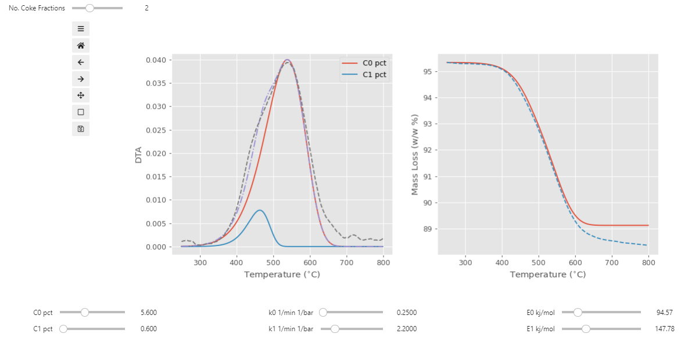
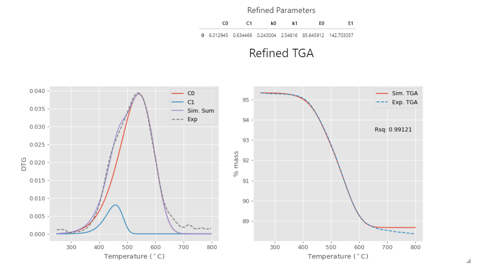

# Interactive Chemical Combustion

## General info

This is a interactive python class for simulating ideal combustion
based on non-linear least squares optimization from experimental
TGA/DTA (Thermal Gravimetric Analysis) data. 

By modelling you decomposition data you can extract chemical information
such as the activiation energy, rate constant, and mass fraction. The 
chemical combustion models allows deconvoluting of DTA curves and
subsequent mass fraction determination, followed by chemical parameters
for each mass fraction.

Please see the example notebook on how to use the combustion class.

## Examples

The chemical parameters are easily found by using the interactive
features of the combustion class.

The guess parameters can then be refined.

## Dependencies

The python class uses ipywidgets and JupyterLab/Jupyter Notebook.
This needs to be configured in your jupyter environment.
